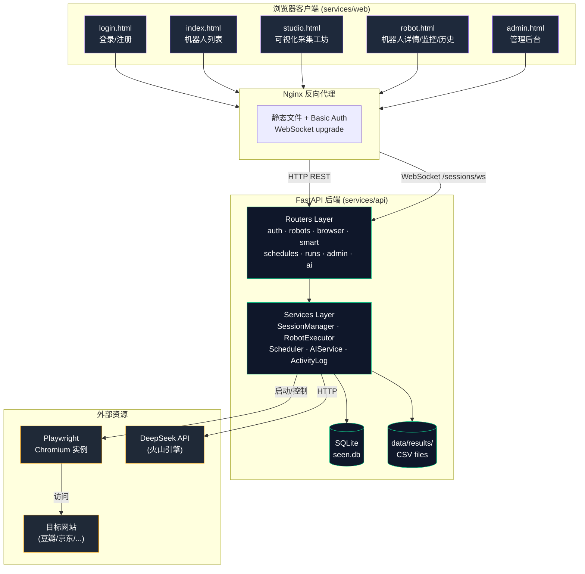
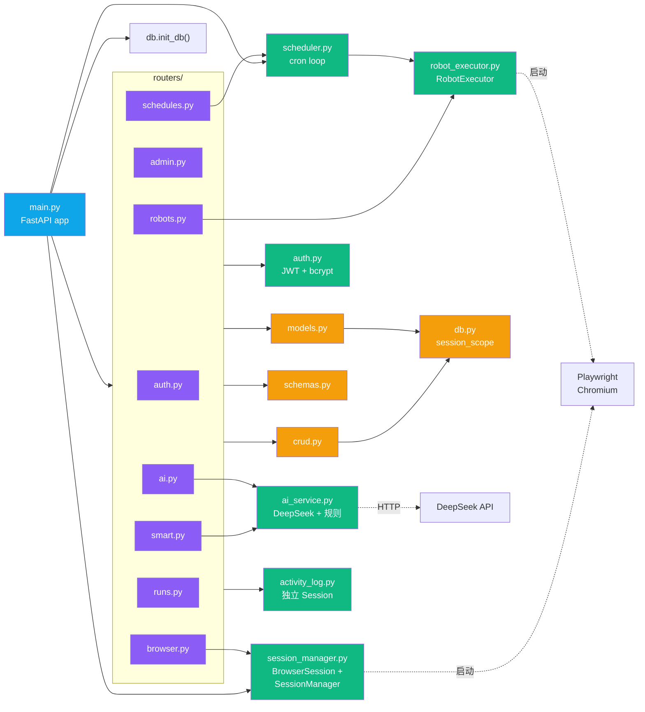
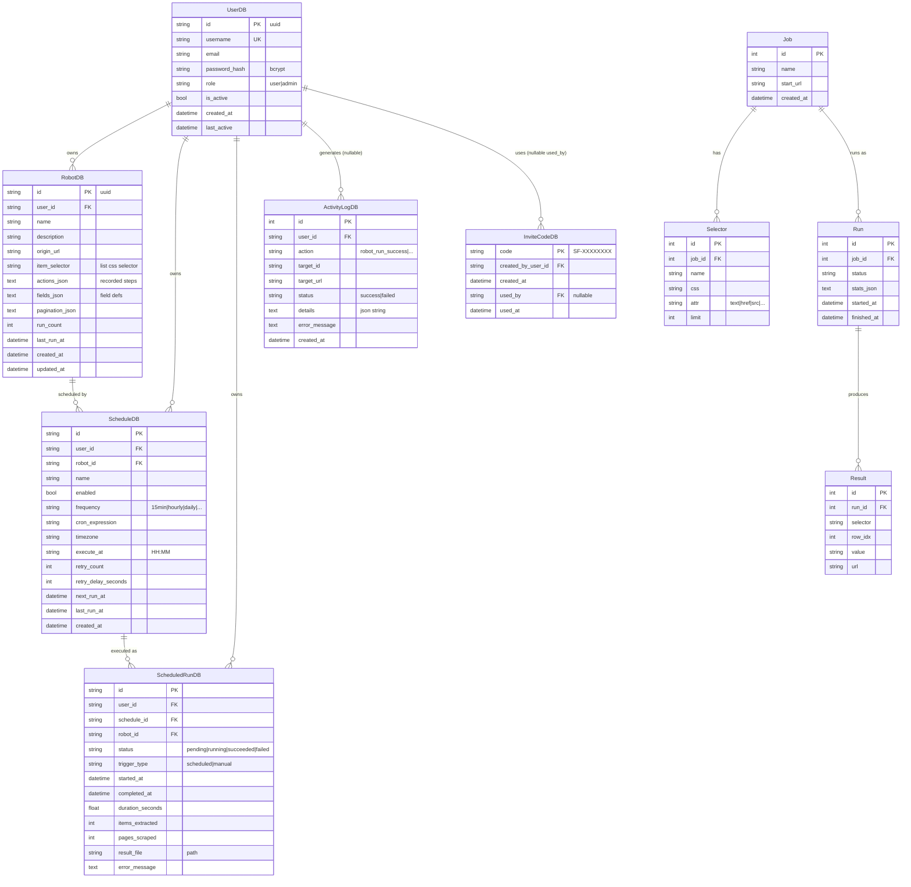
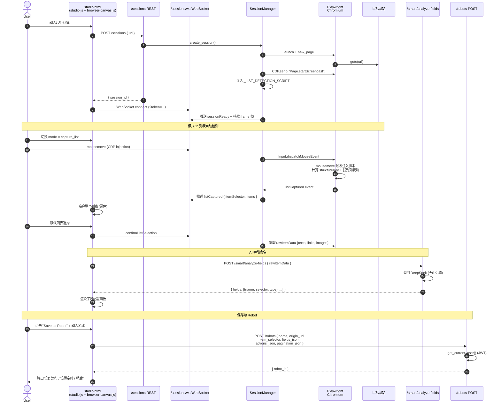
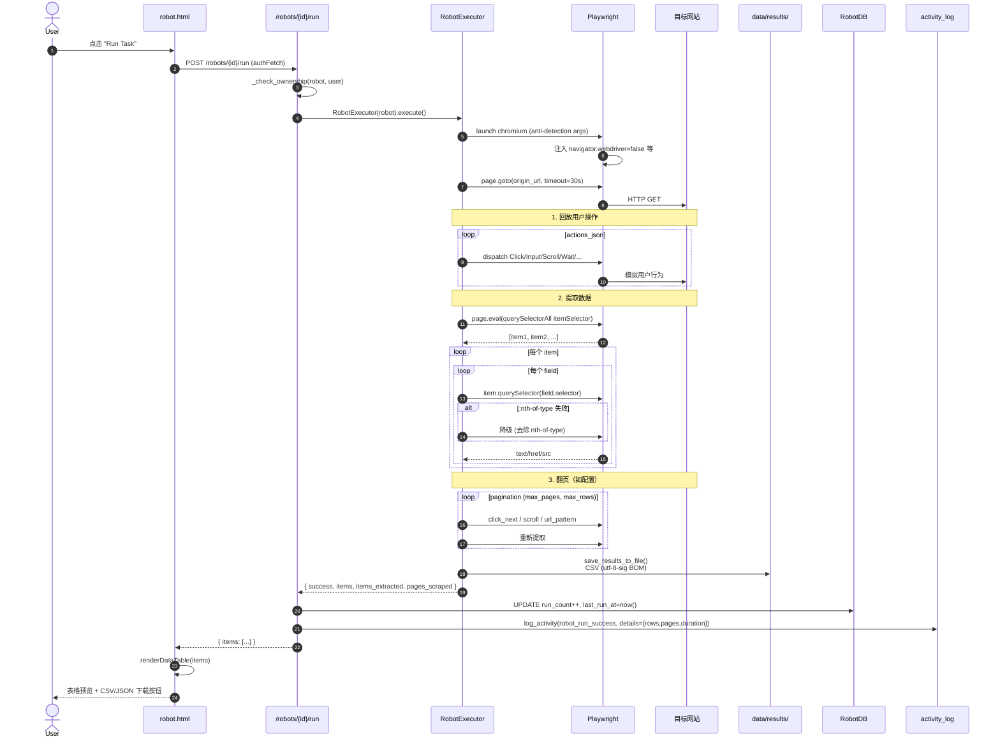
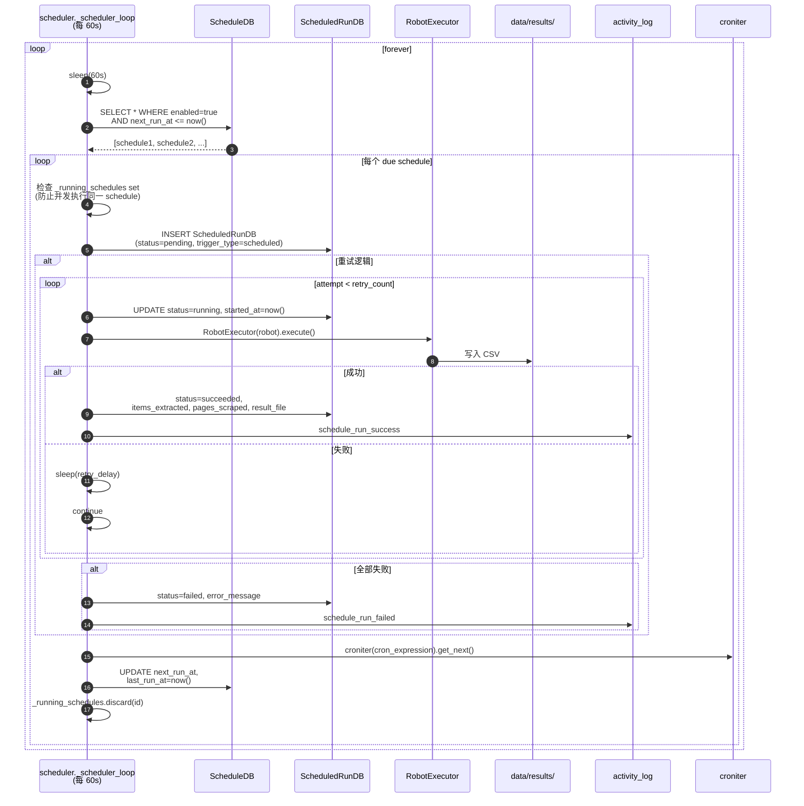

# SeenFetch 项目架构文档

> 毕业设计答辩用 — 完整技术架构说明
> 项目名称：**SeenFetch** — 可视化、AI 增强的网页数据采集系统
> 文档版本：v1.0  ·  生成日期：2026-04-07

---

## 2.1 项目概述

### 2.1.1 项目定位

SeenFetch 是一款面向**非技术用户**的可视化网页数据采集（Web Scraping）平台。用户无需编写任何 CSS 选择器或 XPath，只需在浏览器画布中"点选"目标数据，系统即可自动生成可复用的"机器人（Robot）"，并支持定时调度执行、结果导出与历史回看。

### 2.1.2 核心特性

| 维度 | 能力 |
|------|------|
| **可视化采集** | 远程 Chromium + CDP Screencast 帧推流，浏览器画布实时呈现，鼠标悬停高亮 DOM 元素 |
| **智能列表识别** | 注入 JavaScript 自动检测列表项（基于结构相似度 `structureKey`），一次点击高亮整个列表 |
| **AI 字段命名** | 接入 DeepSeek（火山引擎 endpoint）自动给列表字段起人类友好的中文/英文名 |
| **机器人复用** | 用户操作（点击/输入/滚动）+ item_selector + fields 一并保存为 Robot，可一键回放 |
| **定时调度** | 支持 15min / hourly / daily / weekly / monthly / cron 表达式，croniter 计算下次执行时间 |
| **多用户隔离** | JWT 双 Token（access 30min + refresh 7d）+ user_id FK，所有数据按用户隔离 |
| **管理后台** | 用户管理、邀请码生成、活动日志（Activity Log）、数据看板（统计、柱状图） |
| **结果导出** | CSV（utf-8-sig BOM 兼容 Excel）+ JSON，支持下载与在线查看 |

### 2.1.3 技术栈

```
后端：FastAPI + SQLAlchemy + SQLite + Playwright (Chromium) + WebSocket + croniter
       + python-jose (JWT) + passlib/bcrypt + httpx + BeautifulSoup
前端：原生 HTML + ES6 JavaScript + CSS（Linear 风格暗色主题）+ Lucide SVG 图标
AI  ：DeepSeek (Volcano Engine) Chat Completions API
部署：Docker + Docker Compose + Nginx (反向代理 + Basic Auth + WebSocket upgrade)
```

---

## 2.2 系统架构总览



### 2.2.1 部署拓扑

```
┌────────────────────────────────────────────────────────┐
│                    Docker Host                         │
│                                                        │
│  ┌──────────────────┐         ┌──────────────────┐    │
│  │ seenfetch-       │  proxy  │ seenfetch-       │    │
│  │ frontend         │ ──────► │ backend          │    │
│  │ (nginx:alpine)   │         │ (python:3.11)    │    │
│  │ port 80          │         │ port 8000        │    │
│  │                  │         │                  │    │
│  │ /usr/share/      │         │ /app/data/       │    │
│  │  nginx/html      │         │  seen.db         │    │
│  │ (services/web)   │         │  results/*.csv   │    │
│  └──────────────────┘         │                  │    │
│                                │ Playwright +     │    │
│                                │ Chromium (内嵌)  │    │
│                                └──────────────────┘    │
└────────────────────────────────────────────────────────┘
```

---

## 2.3 后端模块关系

### 2.3.1 后端目录结构

```
services/api/app/
├── main.py              # FastAPI 应用入口 + lifespan + 全局异常 + 路由注册
├── settings.py          # Pydantic Settings (env_prefix=SEENFETCH_)
├── db.py                # SQLAlchemy engine/session + PRAGMA foreign_keys
├── models.py            # 10 张 ORM 表（V1 + V2）
├── schemas.py           # Pydantic 请求/响应 schema
├── crud.py              # 通用 CRUD 函数
├── auth.py              # JWT + bcrypt + get_current_user/require_admin
├── activity_log.py      # 独立 Session 的 fire-and-forget 日志
├── ai_service.py        # 规则引擎 + DeepSeek 调用 (字段命名)
├── session_manager.py   # 浏览器会话 + CDP Screencast + 列表检测注入脚本
├── robot_executor.py    # 机器人回放执行器 (动作回放 + 字段提取 + 翻页)
├── scheduler.py         # cron 调度循环 + 重试 + ScheduledRun 记录
└── routers/
    ├── auth.py          # /auth/{register,login,refresh,me}
    ├── admin.py         # /admin/{stats,users,invite-codes,activity-logs}
    ├── robots.py        # /robots CRUD + /robots/{id}/run
    ├── browser.py       # /sessions REST + WebSocket /sessions/ws/{id}
    ├── smart.py         # /smart/{analyze,validate-selector,analyze-fields}
    ├── schedules.py     # /schedules CRUD + /scheduled-runs/{id}/{result,download}
    ├── runs.py          # V1 (Job-based) 旧版运行记录
    └── ai.py            # /ai/suggest (单元素字段名建议)
```

### 2.3.2 模块依赖关系



### 2.3.3 路由注册一览

[main.py](services/api/app/main.py) 在 `lifespan` 中按以下顺序启动：

1. `init_db()` — 创建表（V1 + V2 共 10 张）
2. `_ensure_admin()` — 若不存在则创建管理员（用户名/密码/邮箱来自 settings）
3. `_migrate_user_id()` — 历史数据回填 user_id（向后兼容旧版）
4. `session_manager.start()` — 启动浏览器清理循环（每 60s 检查超时会话）
5. `scheduler.start()` — 启动调度循环（每 60s 扫描 due 任务）

注册的路由（11 个）：

| Prefix | Tags | 说明 |
|--------|------|------|
| `/auth` | auth | 注册/登录/刷新/me |
| `/admin` | admin | 统计/用户/邀请码/活动日志 |
| `/robots` | robots | 机器人 CRUD + 立即执行 |
| `/sessions` | browser | 浏览器会话 REST + WebSocket |
| `/smart` | smart | 列表检测/选择器校验/字段 AI 分析 |
| `/schedules` | schedules | 定时任务 CRUD + 立即触发 |
| `/scheduled-runs` | runs | 调度运行历史 + 结果下载/查看 |
| `/runs/jobs/{id}/run` | runs | V1 旧版 Job 执行入口 |
| `/runs` | runs | V1 旧版运行记录 |
| `/ai` | ai | 单元素字段名建议 |

---

## 2.4 数据库 ER 图

### 2.4.1 完整数据模型

[models.py](services/api/app/models.py) 共 10 张表，分两代：

- **V1（Job 时代）**：Job → Selector → Run → Result（用于早期 BeautifulSoup 静态采集）
- **V2（Robot 时代）**：UserDB / InviteCodeDB / RobotDB / ScheduleDB / ScheduledRunDB / ActivityLogDB



### 2.4.2 关键设计点

1. **`PRAGMA foreign_keys=ON`**：[db.py](services/api/app/db.py) 通过 SQLAlchemy 事件钩子在每次 connect 时启用 SQLite 外键约束（默认关闭）。
2. **JSON 列**：`actions_json` / `fields_json` / `pagination_json` 用 TEXT 存储，由路由层负责 `json.dumps`/`json.loads`。这种"半结构化"设计允许字段定义自由扩展而无需迁移。
3. **数据隔离**：所有 V2 表都有 `user_id` 外键，路由层通过 `_check_ownership()` 强制校验（admin 角色可越权）。返回 **404** 而非 403，避免泄露资源存在性。
4. **历史兼容**：V1 的 Job/Selector/Run/Result 仍然保留，通过 [routers/runs.py](services/api/app/routers/runs.py) 暴露旧版接口（用于早期 BeautifulSoup 静态爬取场景）。

---

## 2.5 前端页面导航

### 2.5.1 页面结构

```
services/web/
├── index.html       # 首页：机器人卡片网格（按域名分组）
├── login.html       # 登录 / 注册（独立无侧边栏）
├── studio.html      # 可视化采集工坊（核心页面）
├── robot.html       # 机器人详情（Quick Setup / Monitor / History 三 Tab）
├── admin.html       # 管理后台（Dashboard / Users / Invite Codes / Logs 四面板）
├── css/             # 6 个 css 文件，Linear 风格暗色主题
│   ├── base.css     # 全局变量（--bg-primary, --accent-primary 等）
│   ├── home.css
│   ├── studio.css
│   ├── robot.css
│   ├── admin.css
│   └── login.css
└── js/
    ├── auth.js              # token 管理 + authFetch（自动刷新）
    ├── icons.js             # 内联 SVG 图标库（lucide 风格）
    ├── home.js              # 首页：分组展示
    ├── login.js             # 登录注册逻辑
    ├── studio.js            # 工坊状态机（1640 行）
    ├── browser-canvas.js    # 远程浏览器画布 + WebSocket
    ├── robot.js             # 机器人详情三 Tab（1015 行）
    └── admin.js             # 管理后台（411 行）
```

### 2.5.2 页面导航流程

```mermaid
flowchart TD
    Login["login.html<br/>登录/注册"]

    Home["index.html<br/>机器人列表<br/>(按 domain 分组)"]

    Studio["studio.html<br/>可视化采集工坊"]

    Robot["robot.html?id=xxx<br/>机器人详情"]

    Admin["admin.html<br/>管理后台<br/>(admin only)"]

    RobotQuick["Tab: Quick Setup<br/>立即运行 + 数据预览"]
    RobotMonitor["Tab: Monitor<br/>定时任务 CRUD"]
    RobotHistory["Tab: History<br/>所有调度运行记录"]

    AdminDash["Panel: Dashboard<br/>统计 + 柱状图 + 最近活动"]
    AdminUsers["Panel: Users<br/>用户表 + 启用/停用"]
    AdminCodes["Panel: Invite Codes<br/>批量生成 + 删除"]
    AdminLogs["Panel: Activity Logs<br/>分页过滤"]

    Login -->|access_token + refresh_token<br/>localStorage| Home
    Home -->|"+ New Robot"| Studio
    Home -->|点击卡片| Robot
    Home -->|admin role 才显示<br/>topbar Admin link| Admin

    Studio -->|"Save & Later"<br/>"Save & Run Now"| Robot

    Robot --> RobotQuick
    Robot --> RobotMonitor
    Robot --> RobotHistory

    Admin --> AdminDash
    Admin --> AdminUsers
    Admin --> AdminCodes
    Admin --> AdminLogs

    RobotQuick -.返回.-> Home
    RobotMonitor -.返回.-> Home

    classDef page fill:#1e293b,stroke:#8b5cf6,color:#fff
    classDef tab fill:#334155,stroke:#64748b,color:#fff
    class Login,Home,Studio,Robot,Admin page
    class RobotQuick,RobotMonitor,RobotHistory,AdminDash,AdminUsers,AdminCodes,AdminLogs tab
```

### 2.5.3 共享前端机制

- **`API_BASE`** ([auth.js:4](services/web/js/auth.js#L4))：`port==='3000' ? 'http://127.0.0.1:8000' : ''` — 本地开发时显式指向 8000，生产由 Nginx 同源代理。
- **`authFetch(url, options)`** ([auth.js:67](services/web/js/auth.js#L67))：自动注入 `Authorization: Bearer ${token}`，遇到 401 自动调用 `/auth/refresh` 刷新一次，失败则跳转 login.html。
- **`requireAuth()`** ([auth.js:37](services/web/js/auth.js#L37))：每个页面 `DOMContentLoaded` 时调用，无 token 立即跳登录。
- **`renderTopbarUser()`** ([auth.js:99](services/web/js/auth.js#L99))：渲染顶栏用户名；admin 角色自动插入 Admin 链接。

---

## 2.6 核心业务流程

### 2.6.1 用户注册 / 登录流程

```mermaid
sequenceDiagram
    autonumber
    actor U as User
    participant F as login.html / login.js
    participant API as /auth (FastAPI)
    participant DB as UserDB / InviteCodeDB
    participant Log as activity_log

    rect rgb(40, 60, 80)
        Note over U,Log: 注册流程
        U->>F: 输入 username/password/email/invite_code
        F->>API: POST /auth/register
        API->>API: 校验 username 正则 + password >= 8
        API->>DB: 查找 InviteCode (code, used_by IS NULL)
        DB-->>API: 返回 invite (或 404)
        API->>API: bcrypt.hash(password)
        API->>DB: INSERT UserDB
        API->>DB: s.flush() 拿到 user.id
        API->>DB: UPDATE InviteCode SET used_by=user.id
        API->>Log: log_activity(user_register, success)
        API-->>F: 201 + access_token + refresh_token + user
        F->>F: localStorage.saveTokens(...)
        F-->>U: 跳转 index.html
    end

    rect rgb(80, 60, 40)
        Note over U,Log: 登录流程
        U->>F: 输入 username + password
        F->>API: POST /auth/login
        API->>DB: SELECT UserDB WHERE username=?
        alt 用户不存在 / 已禁用
            API->>Log: log_activity(user_login_failed)
            API-->>F: 401
        else 密码错误
            API->>API: bcrypt.verify failed
            API->>Log: log_activity(user_login_failed)
            API-->>F: 401
        else 成功
            API->>API: create_access_token() + create_refresh_token()
            API->>DB: UPDATE last_active = now()
            API->>Log: log_activity(user_login, success)
            API-->>F: 200 + tokens + user
            F->>F: localStorage.saveTokens(...)
            F-->>U: 跳转 index.html
        end
    end
```



### 2.6.2 机器人创建流程（Studio 工坊）



### 2.6.3 机器人执行流程



### 2.6.4 定时调度执行流程



---

## 2.7 关键技术实现

### 2.7.1 CDP Screencast 实时帧推流

[session_manager.py](services/api/app/session_manager.py) 通过 Chrome DevTools Protocol（CDP）实现远程浏览器画面的实时推送：

```python
# 启动 CDP screencast
cdp_session = await self.context.new_cdp_session(self.page)
await cdp_session.send("Page.startScreencast", {
    "format": "jpeg",
    "quality": 80,
    "everyNthFrame": 1
})
cdp_session.on("Page.screencastFrame", self._on_screencast_frame)
```

每收到一帧，回调函数将 base64 编码的 JPEG 广播给所有连接到该 session 的 WebSocket 客户端，并立即调用 `Page.screencastFrameAck` 告知 Chromium 继续推送下一帧。前端 [browser-canvas.js](services/web/js/browser-canvas.js) 把 base64 直接赋值给 `` 的 `src`，浏览器自动解码渲染。

**为什么用 CDP 而不是截图轮询？**
- CDP 是事件驱动的，浏览器有实际变化时才推送，CPU 占用低
- JPEG 压缩 + 80 质量，单帧约 30-80KB，本地局域网可达 30+ FPS
- 支持元数据（`metadata.timestamp`、`offsetTop` 等），便于坐标换算

**反向输入注入**：前端的鼠标/键盘事件通过 WebSocket 发送给后端，后端调用 `Input.dispatchMouseEvent` / `Input.dispatchKeyEvent` 注入到远程浏览器。这构成了一个完整的"远程桌面 + 实时控制"闭环。

### 2.7.2 智能列表检测

[session_manager.py](services/api/app/session_manager.py) 中的 `_LIST_DETECTION_SCRIPT` 是一段注入到目标页面的 JavaScript（在 `add_init_script` 阶段注入，每个新页面自动执行），实现**鼠标悬停时自动识别列表**：

**核心算法**：
1. 监听 `mousemove`（200ms throttle）
2. 对鼠标命中的元素，计算 `structureKey = tag + 前 2 个 class`
3. 向上查找第一个 parent，使其至少有 3 个子元素和命中元素具有相同的 `structureKey`
4. 把所有同结构的兄弟节点视为"列表项"，统一加上虚线高亮
5. 把所有列表项的 selector + relativeSelector + rawItemData (texts/links/images) 通过 `window.postMessage` 发送给后端

**relativeSelector 的妙处**：对于每个文本节点，记录"它在列表项内部的相对路径"（例如 `.title > span:nth-child(1)`），这样后续提取时只需要 `item.querySelector(relativeSelector)`，避免了拼接绝对路径。

### 2.7.3 CSS 选择器自动生成

[session_manager.py](services/api/app/session_manager.py) 注入脚本中的 `getCssSelector(el)` 实现按优先级生成稳定选择器：

```
优先级 1: #id              （若有 id 直接返回 #id）
优先级 2: tag.class1.class2 （取前 2 个 class）
优先级 3: parent > tag:nth-of-type(n)  （回退到位置）
```

这个策略平衡了**唯一性**和**稳定性**：id 最稳定但很多页面没有；class 中等稳定但可能不唯一；nth-of-type 兜底但易受页面变化影响。

### 2.7.4 AI 字段命名（DeepSeek 接入）

[ai_service.py](services/api/app/ai_service.py) 提供两层字段命名能力：

**第一层 — 规则引擎**（无需 API 即可工作）：
- 标签规则：`h1-h3` → "标题"、`a` → "链接"、`img` → "图片"
- 内容规则：包含 `¥` / `$` → "价格"；正则匹配日期 → "日期"
- class 名规则：包含 `title|name|heading` → "标题"

**第二层 — DeepSeek（火山引擎 endpoint）**：
当规则匹配不到时，构造 prompt 调用 DeepSeek Chat Completions API。Prompt 包含：
- 元素的 tag / class / 上下文 HTML 片段
- rawItemData（texts/links/images 三个数组）
- 常见字段名参考表
- 明确指令："优先用 texts 数组中的人类可读文本，links 仅用于 URL 字段，images 仅用于图片 URL"

返回结构：`{ fieldName, confidence, source: 'rule'|'ai', reasoning }`，前端根据 confidence 决定是否采纳。

### 2.7.5 JWT 双 Token 认证

[auth.py](services/api/app/auth.py) 实现 access + refresh 双 token 模式：

| Token | 有效期 | 用途 | 校验 |
|-------|--------|------|------|
| access_token | 30 分钟 | 每次 API 请求携带 | `type=="access"` |
| refresh_token | 7 天 | 仅用于 `/auth/refresh` | `type=="refresh"` |

**前端无感刷新**：[auth.js](services/web/js/auth.js) 的 `authFetch()` 拦截 401 响应，自动调用 `/auth/refresh` 换取新 access_token 后重发请求。这样用户在 7 天内只需登录一次，且不感知 30 分钟的 access 过期。

**JWT 结构**：HS256 签名，payload 包含 `sub=user_id`、`username`、`role`、`type`、`exp`。`get_current_user` 通过 FastAPI 的 `HTTPBearer` 依赖注入，自动从 `Authorization: Bearer xxx` 头中提取并校验。

### 2.7.6 多用户数据隔离

所有 V2 业务表都有 `user_id` 外键。各路由通过两步实现严格隔离：

1. **依赖注入** `current_user: UserDB = Depends(get_current_user)` 确保已登录
2. **`_check_ownership()` 辅助函数**：
   - 从 DB 取出资源
   - 若不存在 → **404**
   - 若 `resource.user_id != current_user.id` 且 `current_user.role != "admin"` → **404**（**不**是 403）

**为什么用 404 而不是 403？** 这是一种安全实践：返回 403 会暴露"该资源存在但你无权访问"，攻击者可借此枚举资源 ID。返回 404 让攻击者无法区分"不存在"和"无权访问"。

### 2.7.7 键盘事件远程转发

[browser-canvas.js](services/web/js/browser-canvas.js) 实现了"在浏览器中点击远程页面的输入框，键盘可以直接打字"的体验：

```javascript
document.addEventListener('keydown', (e) => {
    if (this._typingPending) {
        e.preventDefault();
        this.ws.send(JSON.stringify({
            type: 'keyDown',
            key: e.key,
            code: e.code,
            modifiers: ...
        }));
    }
});
```

后端收到后调用 CDP `Input.dispatchKeyEvent` 注入到远程 Chromium。`_typingPending` 状态由"是否聚焦在输入框上"决定，避免误吞快捷键。

### 2.7.8 反爬虫检测对抗

[session_manager.py](services/api/app/session_manager.py) 和 [robot_executor.py](services/api/app/robot_executor.py) 共享一套 anti-detection 启动参数：

```python
launch_args = [
    "--disable-blink-features=AutomationControlled",
    "--disable-web-security",
    "--no-sandbox",
    "--disable-features=IsolateOrigins,site-per-process",
    ...
]

# 注入隐藏脚本
await page.add_init_script("""
    Object.defineProperty(navigator, 'webdriver', { get: () => false });
    Object.defineProperty(navigator, 'languages', { get: () => ['zh-CN','zh','en'] });
    Object.defineProperty(navigator, 'plugins', { get: () => [1,2,3,4,5] });
""")
```

这些手段可以绕过大部分基于 `navigator.webdriver` 的简单反爬检测（如豆瓣、京东的初级反爬）。

### 2.7.9 Docker / Nginx 部署

**[docker-compose.yml](docker-compose.yml)** 定义两个服务：

- **backend**（[services/api/Dockerfile](services/api/Dockerfile)）：基于 `python:3.11-slim`，预装 Playwright Chromium 所需系统库（libgtk-3-0、libnss3、fonts-noto-cjk 等），通过 `playwright install chromium` 下载浏览器，挂载 `data/` 目录持久化数据库和结果文件。
- **frontend**（`nginx:alpine`）：挂载 `services/web` 静态目录、`nginx.conf` 配置文件、`htpasswd` Basic Auth 密码文件。

**[nginx.conf](nginx.conf)** 关键配置：

1. **全局 Basic Auth**（`auth_basic`）作为第一道访问门槛
2. **每个 API location 关闭 Basic Auth**（`auth_basic off`），由 JWT 自行鉴权 — 形成"Basic Auth 入口 + JWT 业务"双层防护
3. **WebSocket 升级**：仅 `/sessions` 配置 `proxy_set_header Upgrade $http_upgrade` + `Connection "upgrade"` + `proxy_read_timeout 86400`（24 小时长连接）
4. **`/login.html` 单独豁免** Basic Auth，避免登录页本身被 Basic Auth 拦截

### 2.7.10 Activity Logs（活动日志）

[activity_log.py](services/api/app/activity_log.py) 是一个独立的日志写入模块，刻意不复用业务 `session_scope`：

```python
def log_activity(action, user_id=None, target_id=None, ...):
    """fire-and-forget — 永远不抛出异常"""
    try:
        with SessionLocal() as s:  # 独立 Session
            s.add(ActivityLogDB(...))
            s.commit()
    except Exception as e:
        logger.warning(f"activity log failed: {e}")
        # 故意吞掉 — 日志失败不能影响业务
```

**为什么独立 Session？** 业务 Session 可能在抛异常后处于 rollback 状态，此时复用会导致日志也写不进去。独立 Session 保证日志写入和业务事务完全解耦。

**记录的事件**：`user_register` / `user_login` / `user_login_failed` / `robot_create` / `robot_update` / `robot_delete` / `robot_run_success` / `robot_run_failed` / `schedule_create` / `schedule_run_success` / `schedule_run_failed` 等。Admin 后台通过 [routers/admin.py](services/api/app/routers/admin.py) 的 `/admin/activity-logs` 接口分页过滤展示。

---

## 2.8 依赖说明

### 2.8.1 Python 后端依赖

[requirements.txt](services/api/requirements.txt)：

| 包名 | 用途 |
|------|------|
| **fastapi** | Web 框架，提供路由、依赖注入、自动文档 |
| **uvicorn[standard]** | ASGI 服务器，启动 FastAPI 应用 |
| **websockets** | WebSocket 协议支持（CDP 帧推送） |
| **playwright** | 浏览器自动化（Chromium 控制） |
| **sqlalchemy** | ORM，定义模型与查询 |
| **pydantic** + **pydantic-settings** | 数据校验 + 环境变量配置（`SEENFETCH_*`） |
| **httpx** | 异步 HTTP 客户端（调用 DeepSeek API） |
| **croniter** | 解析 cron 表达式 + 计算下一次执行时间 |
| **beautifulsoup4** | V1 静态 HTML 解析（旧版 Job 用） |
| **python-jose[cryptography]** | JWT 编解码（HS256） |
| **passlib[bcrypt]** + **bcrypt==4.2.1** | 密码哈希（bcrypt 锁版本避免 passlib 兼容问题） |

### 2.8.2 前端依赖

**零外部 JavaScript 依赖**。所有功能用原生 ES6 实现：
- HTML 模板：直接写在 `*.html` 文件中
- CSS：手写，使用 CSS 变量定义主题（Linear 风格暗色）
- 图标：[icons.js](services/web/js/icons.js) 内联 Lucide 风格 SVG
- 数据通信：原生 `fetch` + `WebSocket`

这种"无构建、无打包"的设计极大简化了部署 — Nginx 直接挂载源码目录即可。

---

## 2.9 前端 JavaScript 函数清单

### 2.9.1 [auth.js](services/web/js/auth.js)（116 行 — 共享认证）

| 函数 | 作用 |
|------|------|
| `saveTokens / getAccessToken / getRefreshToken / clearTokens` | localStorage token 操作 |
| `getCurrentUser()` | 解析 user JSON |
| `requireAuth()` | 页面守卫，无 token 跳转 login |
| `tryRefreshToken()` | 调用 `/auth/refresh` 换新 access |
| `authFetch(url, options)` | 自动注入 Bearer + 401 自动刷新 |
| `logout()` | 清 token + 跳转 login |
| `renderTopbarUser()` | 渲染顶栏用户名 + admin 链接 |

### 2.9.2 [home.js](services/web/js/home.js)（143 行 — 首页）

| 函数 | 作用 |
|------|------|
| `loadRobots()` | 拉取机器人列表 + 按 domain 分组 |
| `extractDomain(url)` | URL.hostname 提取 |
| `formatRelativeTime(iso)` | "5 分钟前" 格式化 |

### 2.9.3 [studio.js](services/web/js/studio.js)（1640 行 — 工坊核心）

**状态机**（6 个状态）：
```
initial → captureType → listSelect/manualSelect/smartDetect → configuring → done
```

**核心函数**：

| 函数 | 作用 |
|------|------|
| `initStudio()` | 创建 BrowserSession + 初始化 BrowserCanvas |
| `_recordStep(action)` | 把用户操作追加到 `recordedSteps` |
| `_handleListCaptured(detail)` | 收到列表检测结果 → 进入 configuring |
| `_analyzeFieldsWithAI(rawItemData)` | 调用 `/smart/analyze-fields` |
| `renderFieldConfig(fields)` | 渲染字段编辑面板 |
| `saveAsRobot()` | 弹出命名对话框 |
| `doSaveRobot(name)` | POST `/robots` 创建机器人 |
| `_promptNextStep(robotId)` | "立即运行 / 设定时 / 稍后" 三选一 |

### 2.9.4 [browser-canvas.js](services/web/js/browser-canvas.js)（846 行 — 浏览器画布）

| 函数 | 作用 |
|------|------|
| `connect(sessionId)` | 建立 WebSocket（带 token query） |
| `_onMessage(event)` | 分发 frame/elements/listCaptured/error 等 |
| `_renderFrame(base64)` | 把 base64 JPEG 直接赋给 `.src` |
| `_handleMouseMove/Down/Up/Wheel` | 转发为 CDP `Input.dispatchMouseEvent` |
| `_handleKeyDown/Up` | 转发为 CDP `Input.dispatchKeyEvent` |
| `setMode(mode)` | navigate / capture_list / capture_text |
| `_findElementAt(x, y)` | 命中检测（从后向前查找） |
| `_syncSelectedElements()` | 用 selector + rect (5px 容差) 重新匹配 |
| `_renderOverlay()` | 蓝色描边 + 绿色选中态 |

### 2.9.5 [robot.js](services/web/js/robot.js)（1015 行 — 机器人详情）

**Quick Setup Tab**：`loadRobot` / `runTask` / `renderDataTable` / `downloadFile(format)` / `saveName` / `deleteRobot`

**Monitor Tab**：`loadMonitors` / `renderMonitorCard` / `buildFreqDescription` / `openMonitorForm` / `fillFormFromSchedule` / `parseCronForEdit` / `buildCronExpression` / `saveMonitor` / `editMonitor` / `toggleMonitorEnabled` / `deleteMonitor`

**History Tab**：`loadHistory` / `renderStatusBadge` / `downloadRunResult(runId)` / `viewRunResult(runId)`

### 2.9.6 [admin.js](services/web/js/admin.js)（411 行 — 管理后台）

**Dashboard**：`loadDashboard` / `renderStatCards` / `renderBarChart(dailyRuns)` / `renderRecentActivity`

**Users**：`loadUsers` / `renderUsersTable` / `toggleUserStatus(id, newActive)` / `viewUserRobots(userId, username)`

**Invite Codes**：`generateCodes` / `loadInviteCodes` / `renderCodesTable` / `copyCode(code)` / `deleteCode(code)`

**Activity Logs**：`loadActivityLogs(page)` / `renderLogsTable` / `renderLogsPagination` / `formatAction(action)`

### 2.9.7 [icons.js](services/web/js/icons.js)（67 行）

提供约 30 个 lucide 风格的内联 SVG 图标（`scan / plus / play / trash / clipboard / download / bot / globe / eye / fileText / camera / type / checkCircle / xCircle / clock / hourglass / users / userPlus / key / ticket / barChart / activity / calendar / list / save / chevronRight / ...`）。所有图标通过 `_icon(paths, size)` 工厂函数统一生成，无外部依赖。

---

## 2.10 答辩要点速查

### 2.10.1 创新点

1. **CDP Screencast 实时画布** — 不依赖任何第三方远程桌面框架，纯 Playwright + WebSocket 实现 30+ FPS 的远程浏览器交互，且支持反向输入注入
2. **"鼠标悬停 → 自动列表识别"** — 通过 `structureKey` 算法在浏览器内一次 JS 调用完成，无需后端推理
3. **AI + 规则双层字段命名** — 规则引擎覆盖 80% 常见场景（零成本），DeepSeek 兜底处理特殊情况
4. **零构建前端** — 原生 ES6 + CSS 变量，部署只需挂载源码，开发与生产环境完全一致
5. **数据隔离的 404 实践** — 用 404 替代 403 抵御资源 ID 枚举攻击

### 2.10.2 关键代码位置

| 关注点 | 文件 |
|--------|------|
| 应用入口 | [services/api/app/main.py](services/api/app/main.py) |
| 数据模型 | [services/api/app/models.py](services/api/app/models.py) |
| JWT 认证 | [services/api/app/auth.py](services/api/app/auth.py) |
| CDP Screencast | [services/api/app/session_manager.py](services/api/app/session_manager.py) |
| 列表检测脚本 | [session_manager.py `_LIST_DETECTION_SCRIPT`](services/api/app/session_manager.py) |
| 机器人执行器 | [services/api/app/robot_executor.py](services/api/app/robot_executor.py) |
| 调度循环 | [services/api/app/scheduler.py](services/api/app/scheduler.py) |
| AI 字段命名 | [services/api/app/ai_service.py](services/api/app/ai_service.py) |
| 浏览器画布 | [services/web/js/browser-canvas.js](services/web/js/browser-canvas.js) |
| 工坊状态机 | [services/web/js/studio.js](services/web/js/studio.js) |
| 部署配置 | [docker-compose.yml](docker-compose.yml) · [nginx.conf](nginx.conf) · [services/api/Dockerfile](services/api/Dockerfile) |

### 2.10.3 答辩可能的问题

| 问题 | 应答要点 |
|------|----------|
| 为什么不用现成的 Selenium IDE？ | Selenium IDE 只能录制点击，无法可视化高亮"列表项"，且无服务化能力。SeenFetch 把"录制+列表识别+定时调度+多用户"做成一个完整的 SaaS |
| 为什么不用 Scrapy？ | Scrapy 面向开发者，需要写代码定义 Spider。SeenFetch 面向**非技术用户**，零代码 |
| 为什么用 SQLite 而不是 PostgreSQL？ | 项目目标是单机部署 + 易于演示。SQLite 无需独立数据库进程，备份只需复制 `seen.db`。高并发场景可平滑迁移到 PG（SQLAlchemy 屏蔽差异） |
| 反爬怎么办？ | 多层手段：anti-detection 启动参数 + `navigator.webdriver` 注入 + 中文 fonts-noto-cjk + CDP Screencast 比 headless 模式更难被识别。本质上，因为我们用的就是真实 Chromium，绝大多数行为指纹检测都失效 |
| 如何防止用户滥用？ | 邀请码注册（管理员手动发放） + 用户可被禁用 + 全量活动日志审计 + Basic Auth 入口防爬 |
| AI 调用费用怎么控制？ | 优先走规则引擎（零成本），仅在规则失败时调用 DeepSeek。DeepSeek 火山引擎 endpoint 价格极低（约 ¥0.001/次），单次机器人创建总成本不超过 ¥0.01 |

---

> **文档结束** — 如需补充任何章节，请直接在对应小节追加。
